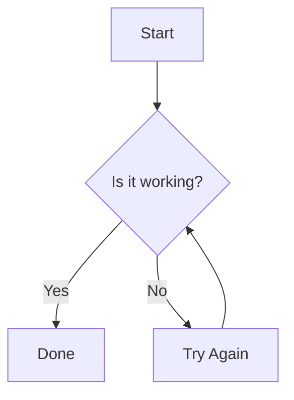
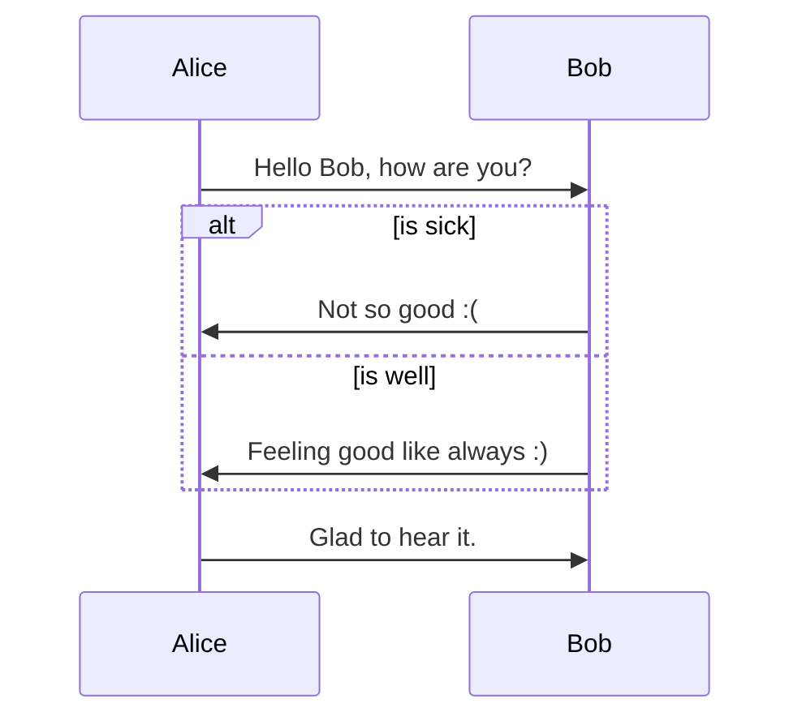
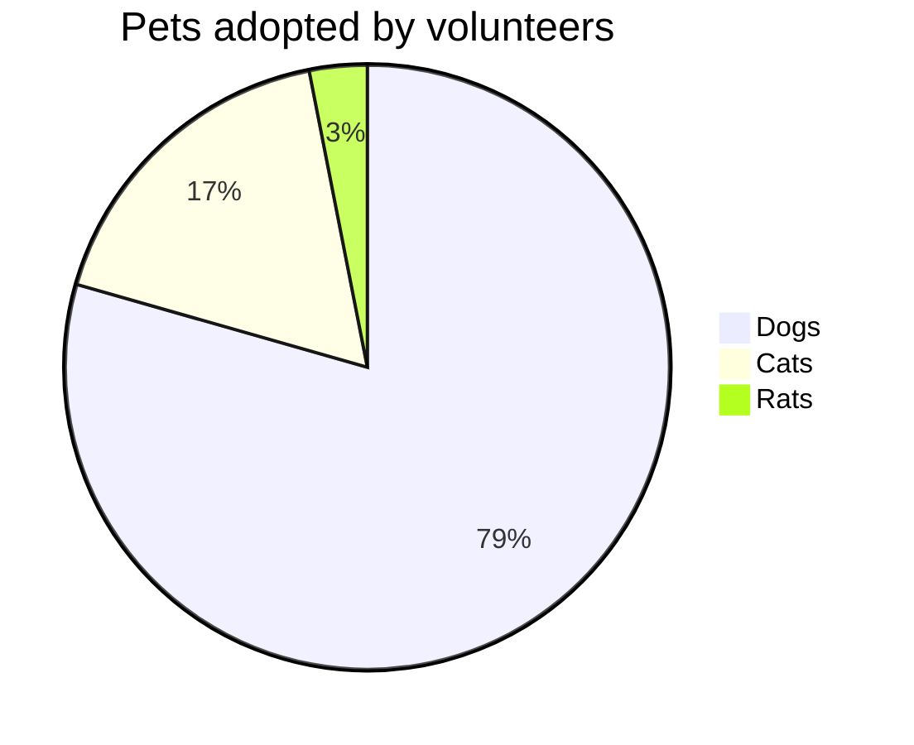

# Comprehensive Markdown Example

## Table of Contents
- [Introduction](#introduction)
- [Typography](#typography)
- [Lists](#lists)
- [Links and Images](#links-and-images)
- [Blockquotes](#blockquotes)
- [Code and Syntax Highlighting](#code-and-syntax-highlighting)
- [Tables](#tables)
- [Task Lists](#task-lists)
- [Footnotes](#footnotes)
- [Diagrams (Mermaid)](#diagrams-mermaid)
- [HTML](#html)
- [Mathematics (KaTeX)](#mathematics-katex)
- [Conclusion](#conclusion)

## Introduction

This document demonstrates **comprehensive Markdown syntax** using GitHub Flavored Markdown (GFM) extensions, plus common extensions like footnotes, task lists, tables, task lists, diagrams via Mermaid, and mathematics via KaTeX/MathJax.

> **Note**: This document showcases features available in GitHub Flavored Markdown and common Markdown extensions.

## Typography

- *Italic*, **bold**, `code`, ~~strikethrough~~, ==highlight==, ^superscript^, ~subscript~
- **_Bold and italic_**, `**bold code**`
- [Links](https://example.com) with [title attribute](https://example.com "Title")
- [Reference-style link][arbitrary case-insensitive text]
- [Reference-style link][]

[arbitrary case-insensitive text]: https://example.com
[arbitrary case-insensitive text]: https://example.com "Optional Title"
[Reference-style link]: https://example.com

## Lists

### Unordered
- Item 1
- Item 2
  - Nested item A
  - Nested item B
- Item 3

### Ordered
1. First item
2. Second item
   1. Nested ordered
   2. Nested ordered
3. Third item

### Mixed
- Task lists (see below)
- Definition lists (via HTML or pandoc extensions)

### Definition Lists (via HTML or pandoc-style)
<dl>
  <dt>Term 1</dt>
  <dd>Definition 1</dd>
  <dt>Term 2</dt>
  <dd>Definition 2</dd>
</dl>

Or using pandoc-style:

Term 1
:   Definition 1

Term 2
:   Definition 2

## Links and Images


[](https://example.com)

![Alt text][image-id]

[image-id]: https://via.placeholder.com/150 "Optional title attribute"

## Blockquotes

> This is a blockquote.
>
> > This is a nested blockquote.
>
> Back to level 1.
>
> - A list inside a blockquote
> - Another item

## Code and Syntax Highlighting

Inline `code` has backticks around it.

```javascript
var s = "JavaScript syntax highlighting";
alert(s);
```

```python
def fibonacci(n):
    """Return the nth Fibonacci number."""
    a, b = 0, 1
    for _ in range(n):
        yield a
        a, b = b, a + b
```

```html
<!DOCTYPE html>
<html>
<head>
    <title>Example</title>
</head>
<body>
    <h1>Hello, world!</h1>
</body>
</html>
```

```sql
SELECT *
FROM users
WHERE age > 18
ORDER BY name;
```

## Tables

| Left-aligned | Center-aligned | Right-aligned |
|:-------------|:--------------:|--------------:|
| Cell 1       | Cell 2         | Cell 3        |
| Cell 4       | Cell 5         | Cell 6        |
| Very long text that wraps | More text | Even more text |

| Header 1 | Header 2 | Header 3 |
|----------|----------|----------|
| Row 1 Col 1 | Row 1 Col 2 | Row 1 Col 3 |
| Row 2 Col 1 | Row 2 Col 2 | Row 2 Col 3 |

## Task Lists

- [x] Write the press release
- [ ] Update the website
- [ ] Contact the press
- [ ] **Done!**

- [x] **Completed task**
- [ ] Incomplete task
  - [ ] Nested sub-task
  - [x] Completed sub-task

## Footnotes

Here's a sentence with a footnote. [^1]

[^1]: This is the footnote.

Here's another footnote reference.[^longnote]

[^longnote]: Here's one with multiple blocks.

    Subsequent paragraphs are indented to show that they
belong to the previous footnote.

        { some.code }

    The whole paragraph can be indented, but the first
    line must be spaced correctly.

    { more.code }

## Diagrams (Mermaid)







## HTML

You can also use raw HTML in Markdown (depending on the renderer).

<dl>
  <dt>Definition list</dt>
  <dd>Is something people use sometimes.</dd>

  <dt>Markdown in HTML</dt>
  <dd>Does *not* work **very** well. Use HTML <em>tags</em>.</dd>
</dl>

<table>
  <tr>
    <th>Name</th>
    <th>Age</th>
  </tr>
  <tr>
    <td>Alice</td>
    <td>25</td>
  </tr>
  <tr>
    <td>Bob</td>
    <td>30</td>
  </tr>
</table>

## Mathematics (KaTeX/MathJax)

Inline math: $E = mc^2$.

Display math:
$$
\frac{d}{dx}\left( \int_{0}^{x} f(u)\,du\right)=f(x).
$$

$$
\begin{aligned}
\nabla \times \vec{\mathbf{B}} -\, \frac1c\, \frac{\partial\vec{\mathbf{E}}}{\partial t} &
= \frac{4\pi}{c}\vec{\mathbf{j}} \\[1em]
\nabla \cdot \vec{\mathbf{E}} & = 4 \pi \rho \\
\nabla \cdot \vec{\mathbf{B}} & = 0 \\
\nabla \times \vec{\mathbf{E}}\, +\, \frac1c\, \frac{\partial\vec{\mathbf{B}}}{\partial t} &
= 0
\end{aligned}
$$

## Conclusion

Markdown is a versatile markup language that, with extensions, can handle most documentation needs.

[^1]: This is the first footnote.

[^longnote]: Here's one with multiple blocks.

    Subsequent paragraphs are indented to show that they
belong to the previous footnote.

        { some.code }

    The whole paragraph can be indented, but the first
    line must be spaced correctly.

    { more.code }